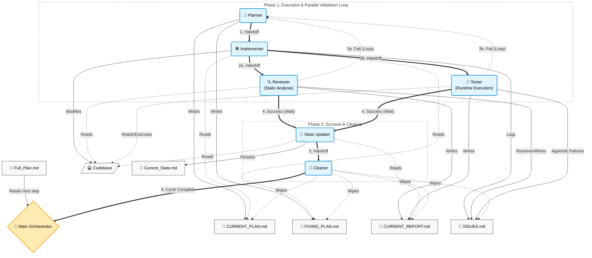

```mermaid
graph TD
    %% Styling Definitions
    classDef orchestrator fill:#ffecb3,stroke:#ff8f00,stroke-width:2px,color:#000;
    classDef agent fill:#e1f5fe,stroke:#0288d1,stroke-width:2px,color:#000;
    classDef artifact fill:#f9f9f9,stroke:#333,stroke-width:1px,color:#000;
    classDef phase fill:#ffffff,stroke:#b0bec5,stroke-width:2px,stroke-dasharray: 5 5;

    %% ==========================================
    %% ORCHESTRATION LEVEL
    %% ==========================================
    FullPlan["📄 Full_Plan.md"]:::artifact
    MainOrchestrator{"🤖 Main Orchestrator"}:::orchestrator
    FullPlan -->|Reads next step| MainOrchestrator

    %% ==========================================
    %% AGENT PIPELINE
    %% ==========================================
    subgraph CoreLoop [Phase 1: Execution & Parallel Validation Loop]
        PrecisePlanner("🧠 Planner"):::agent
        Implementer("🛠️ Implementer"):::agent
        
        %% Parallel Validators
        Reviewer("🔍 Reviewer<br>(Static Analysis)"):::agent
        Tester("🧪 Tester<br>(Runtime Execution)"):::agent
    end

    subgraph Finalization [Phase 2: Success & Cleanup]
        StateUpdater("📝 State Updater"):::agent
        Cleaner("🧹 Cleaner"):::agent
    end
    
    class CoreLoop,Finalization phase;

    %% STRICT CONTROL FLOW
    PrecisePlanner == "1. Handoff" ==> Implementer
    
    %% Parallel Fork
    Implementer == "2a. Handoff" ==> Reviewer
    Implementer == "2b. Handoff" ==> Tester
    
    %% Fail State (Either can trigger a loop back)
    Reviewer -. "3a. Fail (Loop)" .-> PrecisePlanner
    Tester -. "3b. Fail (Loop)" .-> PrecisePlanner
    
    %% Success State (Join)
    Reviewer == "4. Success (Wait)" ==> StateUpdater
    Tester == "4. Success (Wait)" ==> StateUpdater
    
    StateUpdater == "5. Handoff" ==> Cleaner
    Cleaner == "6. Cycle Complete" ==> MainOrchestrator

    %% ==========================================
    %% ARTIFACTS LEVEL
    %% ==========================================
    CurrentPlan["📄 CURRENT_PLAN.md"]:::artifact
    FixingPlan["📄 FIXING_PLAN.md"]:::artifact
    Codebase[/"💻 Codebase"/]:::artifact
    Issues["📄 ISSUES.md"]:::artifact
    PlanReport["📄 CURRENT_REPORT.md"]:::artifact
    CurrentState["📄 Current_State.md"]:::artifact

    %% ==========================================
    %% LAYOUT ENFORCEMENT PILLARS
    %% ==========================================
    PrecisePlanner ~~~ CurrentPlan
    Implementer ~~~ Codebase
    Tester ~~~ Issues
    StateUpdater ~~~ CurrentState

    %% ==========================================
    %% DATA FLOW (Strictly Downward)
    %% ==========================================
    %% Planner
    PrecisePlanner -->|Writes| CurrentPlan
    PrecisePlanner -->|Writes| FixingPlan
    
    %% Implementer
    Implementer -. Reads .-> CurrentPlan
    Implementer -. Reads .-> FixingPlan
    Implementer -->|Modifies| Codebase
    Implementer -->|Logs| Issues
    
    %% Parallel Validation I/O
    Reviewer -. Reads .-> Codebase
    Reviewer -->|Resolves/Writes| Issues
    Reviewer -->|Writes| PlanReport
    
    Tester -. Reads/Executes .-> Codebase
    Tester -->|Appends Failures| Issues
    Tester -->|Writes| PlanReport
    
    %% State Updater
    StateUpdater -. Reads .-> PlanReport
    StateUpdater -. Reads .-> Codebase
    StateUpdater -->|Persists| CurrentState

    %% Cleaner
    Cleaner -. Wipes .-> CurrentPlan
    Cleaner -. Wipes .-> FixingPlan
    Cleaner -. Wipes .-> PlanReport
    Cleaner -. Wipes .-> Issues
```